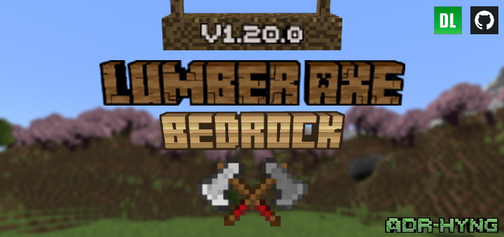
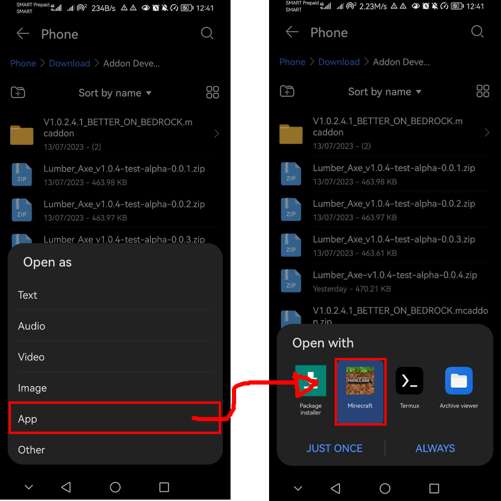
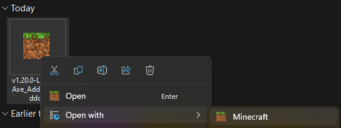
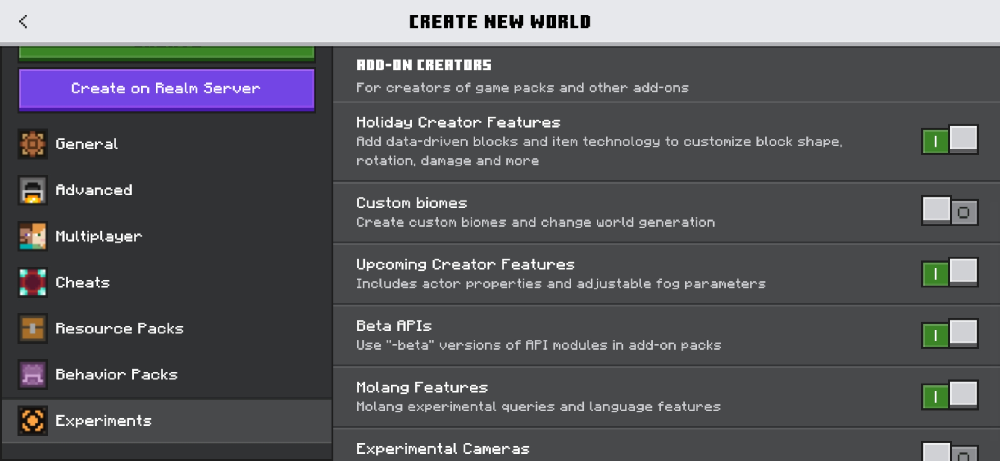

<h1 align="center"> <strong> Lumber-Axe </strong> </h1>

<!-- img.shield's live badge not working consistently. -->
<!--  -->

<!--  -->

  
  
  
  
  
  
  

-----

🪓 Lumber axe is an addon that chops a whole tree of connected blocks of logs down with just a single break at any side of the connected block of log. This accurately chops the whole tree down with the power of Minecraft Bedrock's Experimental Features.

##### **Note: Don't use the lumber axe tool to your valuable structures that has any type of logs in it, especially if the block of logs are connected.**

 

<h1 align="center" >🎮 <a href="https://www.youtube.com/watch?v=m95KutIwvp8"><strong>Installation</strong> </a> 🎮</h1>
<h3 align="center">Here are the ways to install the addon on your device. Make sure to download the addon packs first.</h3>

## 📱 *Pocket Edition:*

- After downloading the `Behavior Pack` and `Resource Pack` in `.mcpack` or `.mcaddon` form, open it in the file system or **File** app. Follow this step-by-step guide through your phone: `Open as -> App (Others if Minecraft is not there) -> Minecraft`.   

- After opening it in the Minecraft app, it will automatically install the addon in your minecraft folder. 

## 💻 *Windows Edition:*

- After downloading the `Behavior Pack` and `Resource Pack` in `.mcpack` or `.mcaddon` form, open it by selecting *Minecraft: Windows Edition* as the application: 
  
  > It will automatically install the `Behavior Pack & Resource Pack` if you opened the `.mcaddon` file.   > It will automatically install `Behavior Pack` if you installed the **v1.20.0-Lumber_Axe_BP.mcpack**, and **v1.20.0-Lumber_Axe_BP.mcpack** for `Resource Pack`.
- After installing both packs, you can add it to your own world with few setup to work with In-game.

## 🕹️ *In-Game:*

Make sure you **TURN ON** the following features or capabilities in the game:

To fully activate the addon. Make sure to activate the Behavior Pack and Resource Pack to your selected world.

 

<h1 align="center" >📃 <a href="./LICENSE"><strong>License</strong></a> 📃</h1>

✅ *You are permitted to:*

- Examine the code / work to learn more about the creation and development of add-ons.
- Change the code / work to suit your needs.
- Took some of the code / work to your project, as long as you give credits to the respective author.
- Distribute the code / work.

⛔ *You are NOT permitted to:*

- Negate the accreditation of the original author.
- Change the license of the code / work you've modified.
- Make modified code / work closed source.

 

<h1 align="center"> <strong> ✨ More Info ✨ </strong> <h1>

  
  
  
  

